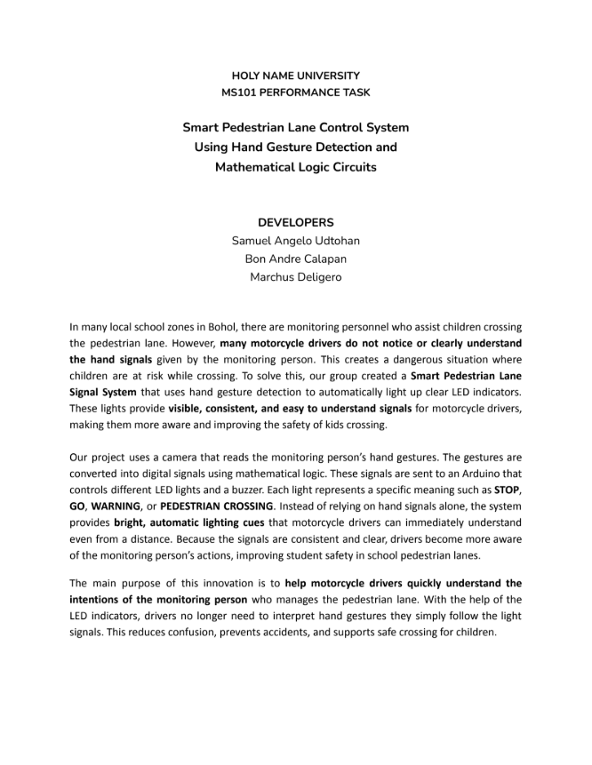
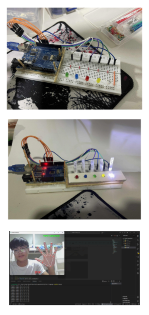
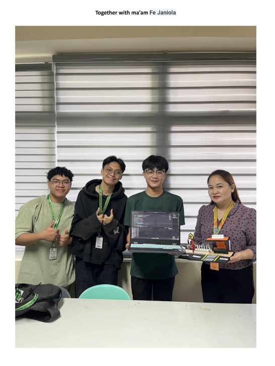

# Hand Gesture Recognition Traffic Control System

## Project Overview

This project uses **hand gesture detection** with a webcam to recognize finger positions and control an Arduino-based LED and buzzer system. The system simulates a **traffic signal/pedestrian detection system** by interpreting different finger counts as traffic control signals.





## Features

- 🤚 **Real-time Hand Detection**: Uses MediaPipe for accurate hand tracking
- 📹 **Webcam Input**: Real-time video feed processing with OpenCV
- 💡 **LED Control**: 5 LEDs controlled based on finger count
- 🔊 **Buzzer Feedback**: Audio alerts for hand detection and gestures
- 📡 **Serial Communication**: Arduino communication via USB/COM port
- 🚦 **Traffic Signal Simulation**: Different finger counts represent different signals

## Hardware Components

### Arduino Pins Configuration

| Component | Arduino Pin | Description |
|-----------|------------|-------------|
| LED 1 | Pin 8 | For 5 fingers (STOP) |
| LED 2 | Pin 9 | For 4 fingers (Pedestrian Lane) |
| LED 3 | Pin 10 | For 3 fingers (GO) |
| LED 4 | Pin 11 | For 2 fingers (Slow Down) |
| LED 5 | Pin 12 | For 1 finger (Warning) |
| Buzzer | Pin 6 | Audio alert (1200Hz for hand detection, 500Hz for no fingers) |

### Finger Count Signals

| Fingers | Signal | LED | Buzzer | Status |
|---------|--------|-----|--------|--------|
| 0 | No one manage | OFF | 500Hz (300ms) | Error state |
| 1 | Warning | LED at Pin 12 | Silent | Caution |
| 2 | Slow Down | LED at Pin 11 | Silent | Reduced speed |
| 3 | GO | LED at Pin 10 | Silent | Safe to proceed |
| 4 | Pedestrian Lane Walking | LED at Pin 9 | Silent | Pedestrian mode |
| 5 | STOP | LED at Pin 8 | Silent | All stop |

## System Requirements

- **Arduino Board** (Uno, Mega, or compatible)
- **Webcam** (USB camera)
- **Python 3.7 or later**
- **Windows, macOS, or Linux**
- **USB Cable** (for Arduino communication)

## Setup Instructions

### 1. Arduino Board Setup

1. Connect your Arduino board to your computer via USB cable
2. Open Arduino IDE
3. Select the board type: **Tools → Board → Arduino Uno** (or your board type)
4. Select the COM port: **Tools → Port → COM4** (check which COM port Arduino uses)

### 2. Python Environment Setup

#### Option A: Using pip

```bash
# Navigate to the project directory
cd "C:\Users\Sam Nahutdo\Desktop\samnahutdo\MS101"

# (Optional) Create a virtual environment
python -m venv venv
venv\Scripts\activate  # On Windows

# Install required modules
pip install opencv-python
pip install mediapipe
pip install pyserial
```

#### Option B: Windows (Direct Installation)

If you don't have Python installed, download it from https://www.python.org/downloads/ and make sure to check **"Add Python to PATH"** during installation.

### 3. Arduino Code Installation

1. Open **Arduino IDE**
2. Open the sketch file: **Arduino.cpp**
3. Upload to Arduino:
   - Click **Upload** button (or Ctrl+U)
   - Wait for "Done uploading" message

---

## How to Compile and Run

### Compiling C++ to Arduino Code

The **Arduino.cpp** file is already in the correct Arduino format. Here's how to compile and upload it:

1. **Open Arduino IDE**
2. **File → Open → Select Arduino.cpp**
3. **Verify Code** (Ctrl+R)
   - This compiles the code and checks for errors
4. **Upload** (Ctrl+U)
   - Compiles and uploads the code to the Arduino board
   - Wait for the message: `"Avrdude done. Thank you."`
5. **Check Serial Monitor** (Tools → Serial Monitor)
   - Set Baud Rate to **9600**
   - Should show connection messages

### Running Python Hand Detection

1. **Open Command Prompt or PowerShell**
2. **Navigate to project directory:**
   ```bash
   cd "C:\Users\Sam Nahutdo\Desktop\samnahutdo\MS101"
   ```

3. **Activate virtual environment** (if created):
   ```bash
   venv\Scripts\activate
   ```

4. **Run the Python script:**
   ```bash
   python main.py
   ```

5. **What happens:**
   - Webcam window opens with live hand detection
   - Green text = Hand detected
   - Red text = No hand detected
   - LEDs light up based on finger count
   - Press **ESC** to exit the program

---

## Module Installation Guide

### Required Python Modules

```bash
# OpenCV - For video capture and image processing
pip install opencv-python

# MediaPipe - For hand landmark detection
pip install mediapipe

# PySerial - For Arduino communication
pip install pyserial
```

### Verify Installation

Test that modules are installed correctly:

```bash
python -c "import cv2; print('OpenCV OK')"
python -c "import mediapipe; print('MediaPipe OK')"
python -c "import serial; print('PySerial OK')"
```

All three should print "OK" messages.

---

## Troubleshooting

### Arduino Issues

- **Upload fails**: Check COM port is correct (Tools → Port)
- **No serial connection**: Reinstall Arduino USB drivers
- **LEDs don't light up**: Check pin connections and power supply

### Python Issues

- **"ModuleNotFoundError"**: Run `pip install` commands again
- **Webcam not working**: Check webcam is not in use by another program
- **Serial port busy**: Close Arduino IDE or other serial apps
- **Change COM port**: Edit `main.py` line 9: `serial.Serial(port='COM4', ...)` to your port

### Hand Detection Issues

- **Hand not detected**: Ensure good lighting and clear hand visibility
- **Fingers not detected**: Make sure hand is fully in frame with fingers extended

---

## Project File Structure

```
MS101/
├── Arduino.cpp           # Arduino microcontroller code
├── main.py              # Python hand detection & control script
├── README.md            # This file
├── pic1.png             # Project photo 1
├── pic2.png             # Project photo 2
└── pic3.png             # Project photo 3
```

---

## How It Works

1. **Python Side (main.py)**:
   - Captures video from webcam
   - MediaPipe analyzes hand landmarks
   - Detects which fingers are extended
   - Sends finger states to Arduino via serial port (9600 baud)

2. **Arduino Side (Arduino.cpp)**:
   - Receives 5 bytes representing finger states (0 or 1)
   - Counts how many fingers are detected
   - Controls LEDs inversely (5 fingers → LED pin 8, 1 finger → LED pin 12)
   - Triggers buzzer on hand detection or when no fingers are found

---

## Connection Diagram

```
Laptop (Python)
    ↓ USB Cable
Arduino Uno
    ├── Pin 8 → LED 1
    ├── Pin 9 → LED 2
    ├── Pin 10 → LED 3
    ├── Pin 11 → LED 4
    ├── Pin 12 → LED 5
    ├── Pin 6 → Buzzer
    └── GND → Ground connection
```

---

## Notes

- The project uses **inverse LED mapping** (5 fingers lights LED at pin 8, 1 finger lights LED at pin 12)
- Buzzer plays two 1200Hz beeps when hand is first detected
- Serial communication runs at **9600 baud rate**
- Ensure Arduino and Python are synchronized on the same COM port

---

## Author
**Sam Nahutdo**  
MS101 Project - Hand Gesture Recognition Traffic Control System

---

## License
This project is for educational purposes.


yes yes yes


jcbercebicbeibve 


eferg8egcisgc
fejcgecguege
vegueugeerf


